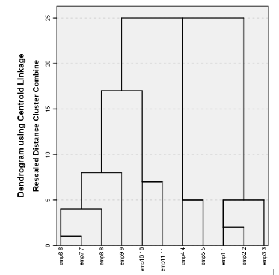

```
Em análise de dados, os algoritmos de cluster são considerados

  - Modelos de Segmentação

No algoritmo de Cluster, qual o objetivo de padronizar as variáveis do banco de dados?

  - Para evitar que variáveis de escalas diferentes tenham peso maior no cálculo das distâncias

O que é um Dendrograma?

  - É uma representação gráfica de todos os passos realizados pelo cluster hierárquico que pode ajudar o analista escolher a quantidade de grupos	
	
Durante as aulas de Cluster foram trabalhados dois métodos de agrupamento, single e complete. Responda: Qual a afirmação abaixo está correta acerca desses métodos?	

  - Single (vizinho mais próximo): Define-se como o Mínimo da distância entre os elementos. Complete (Vizinho mais longe): Define-se como o Máximo da distância entre os elementos
  
No Cluster de K-Médias, o que é a semente?

  - Valor utilizados pelo método K-means para fixar o valor aleatório e evitar que os valores mudem ao reproduzir o cluster novamente
  
Um analista de negócios resolveu separar as empresas de seu portfólio em grupos para simplificar a gestão de sua carteira. 
Após ajustar um modelo utilizando o cluster hierárquico, obteve-se o dendrograma apresentado na imagem abaixo. O gestor deseja quatro grupos, quais as empresas devem fazer parte de cada grupo?

```



```

Grupo 1: (emp 6, emp7, emp8, emp9). Grupo 2: (emp10, emp11). Grupo 3: (emp4, emp5). Grupo 5: emp1, emp2, emp3

```